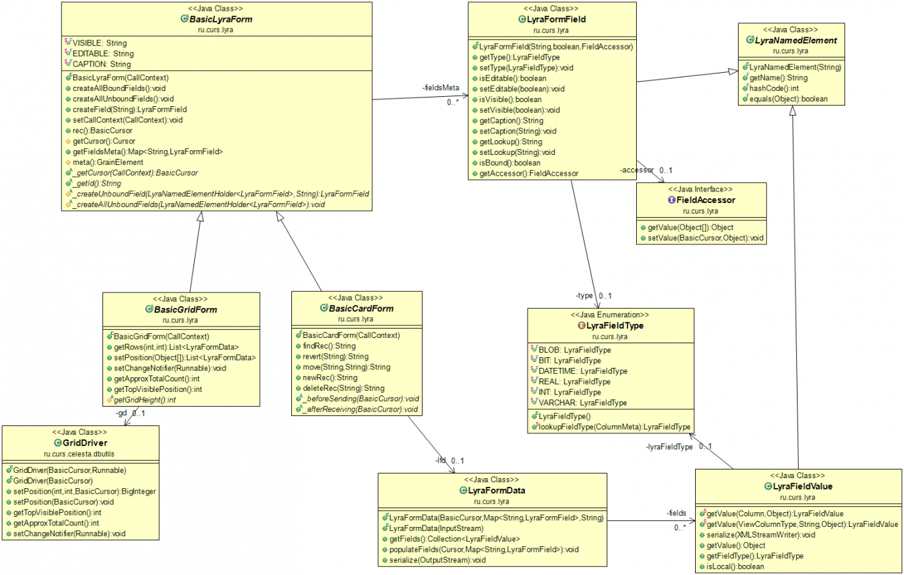

= Lyra Grid
:toc: left

== Introduction

The aim is to develop a back end for the lyra grid. This should be a .jar file
available on Maven Central, so one can easily integrate it in their project using any modern build tool.

This .jar should provide all the needed RESTful services for Lyra Grid UI (client side written in Javascript).

We are going to use:

* Spring Boot

* https://github.com/CourseOrchestra/spring-boot-starter-celesta[Celesta Spring Boot Starter]

As a prototype, and for your reference as a working example example of RESTful Celesta services, you can use the following project: https://github.com/inponomarev/celesta-demo

For `GridDriver` usage, please refer this project: https://github.com/inponomarev/lyragrid-demo

== What's Already Done

* All the needed dependencies are already included into the POM file.

* Also, I copied all the `ru.curs.lyra` classes into this project from Celesta project. These classes should be removed
from Celesta 7.x.

== Main Components

The rough architectural picture can be presented as following:

[plantuml, classes, png]
----
@startuml
package ru.curs.lyra {

class LyraService <<@Component>> {

 + LyraService(@Autowired celesta: Celesta)

 + @CelestaTransaction getRows(...)

}

class LyraController {

 + LyraController(@Autowired lyra: LyraService)

 + @GetMapping("...") getColumns(FormName: String)
 + @GetMapping("...") getRows(FormName: String, rowNum: int)
 + ...()

}

abstract class BasicGridForm {

}

LyraService --* LyraController
LyraService "1"--"*" BasicGridForm

annotation FormField

}

package ru.curs.melbet {

class BetsGrid <<@Component>> extends BasicGridForm {

  + BetsGrid(@Autowired lyra: LyraService)

  + @FormField getSmth()

}

}

package ru.curs.iasbp {

class AccidentsGrid <<@Component>> extends BasicGridForm {

  + AccidentsGrid(@Autowired lyra: LyraService)

}

@enduml
----

`LyraController` and `LyraService` follow layered architecture paradigm.

`LyraController` provides HTTP request handlers.

== Lyra User Guide

Lyra provides a quick way to develop user interface forms linked to https://courseorchestra.github.io/celesta/#data_accessors_section[Celesta cursors]. Cursors can be filtered and sorted.

In order to use lyra, one should add the following dependency to their project:

[source, xml]
----
<dependency>
<groupId>ru.curs</groupId>
<artifactId>lyra</artifactId>
<version>1.0.0-SNAPSHOT</version>
</dependency>
----

=== Lyra form

Lyra forms can be of two types: Card and Grid. Each form is defined by a class inherited from the appropriate base class (`lyra.cardForm.CardForm` or `lyra.gridForm.GridForm`). The form itself is set declaratively and is characterized by:

* *https://courseorchestra.github.io/celesta/#data_accessors_section[Cursor]*, to which the form is linked. Each of the Lyra forms must override the `_getCursor (CallContext context)` method, which must return the corresponding Celesta cursor. If necessary, in the same method, filters and sorting can be applied to the cursor.
* *set of bound and ubound fields* displayed on the form.

Lyra takes on the task of transferring information between the form and the server, as well as navigating through the table records.
The grid form also by itself solves the problem of fast display, scrolling and positioning of the grid with a large number of records.
For the developer it is sufficient only to declare the fields they would like to have on the form, with order and properties.

==== Field Types
Fields, as already mentioned, can be of two types:

* *bound* with the cursor field (i.e. column of the table), the values of the bound fields are stored in the database automatically,

* *unbound*, that is, not linked with any of the fields of the cursor, but with a getter/setter method of the form class.

When the user edits the bound fields, their new values are written into the fields of the cursor and stored in the database automatically.
The values of the unbound fields are passed as parameters to the appropriate methods, and Java code executed on the server can use these values.

==== Designing a form from scratch in five steps ===
To create a Lyra form from scratch, you must follow the following steps:

*Step 1.* Create a class inherited from `BasicCardForm` or `BasicGridForm`, optionally annotated with @Form:

[source,java]
----
class TestForm extends BasicCardForm{
....
}
----

or
[source,java]
----
@Form(gridwidth="600px",
      gridheight="200px")
class TestForm extends BasicGridForm{
....
}
----

*Step 2*. Override `getCursor(CallContext context)` method so it returns sorted and filtered cursor.
This cursor is going to be the source of the record set for the form:

[source,java]
----
   TestCursor getCursor(CallContext context){
        TestCursor result = new TestCursor(context);
        result.setRange("myField", myFilterValue);
        return result;
   }
----

*Step 3 (optional).* If you need unbounded fields on the form, one must declare them as getters and, optionally, setters, annotated with `@FormField`.
Getters / setters should follow the Java getter/setter names convention:
[source,java]
----
    @FormField(celestatype="INT",
               caption="Подпись поля",
               width=30)
    public int getMyField() {
        return this.my;
    }

    public void setMyField(int value) {
       this.my = value;
    }
----

*Step 3 (optional).* You may use CelestaSQL's CelestaDoc to set the bound field's properties.
You may omit this step as well: first, Lyra will choose reasonable default values (e.g. table field name for caption,
as needed in most cases); second, all the properties definitions can be set in the form's class itself.

[source,sql]
----
create table test (
/**
 {"caption": "Identifier"}
 */
id int not null default seq primary key,

/**
 {"caption": "Integer Value"}
 */
attrInt int default 3
);
----

*Step 5*. In the form class constructor, define the set and order of form fields  by calling the following methods:

* `LyraFormField createField(String name)` adds a field with the given name to the form and returns an object of type LyraFormField. The name value must match

** either one of the column names of the form cursor (this creates a bound field),

** or with the name of the property of the form class declared with `@FormField` annotation, this creates and unbound field.

_The `LyraFormField` object returned by the `createField` method then can be modified via its properties.
_

* `createAllBoundFields()`, which is equivalent to calling the `createField` method for each of the table fields.

* `createAllUnboundFields()`, which is equivalent to calling the createField method for each of the properties of a class declared with `@FormField` annotation.

For example, if we want all unbound fields in the form to go first, and then all bound fields, and we are satisfied with the default / `CelestaDoc` / annotation-set field property values, then we can write this:

[source,java]
----
    public TestForm(CallContext context){
        super(context);
        createAllUnboundFields();
        createAllBoundFields();
    }
----

When writing a form constructor, the developer can choose one of the strategies so that the code is the most elegant, concise and flexible. As a rule, the choice of strategy is determined by one of the typical scenarios that one has to face:

[cols="1, 1, options="header"]
|====
^.^|Scenario
^.^|Form construction strategy
| There is only one table-based form in the entire application. Or there can be many forms for one table, but on any form you need to display all the fields of the table or view in accordance with the CelestaDoc-specified properties.
| You should use the `createAllBoundFields ()` method, setting the CelestaDoc for the fields, if necessary. In particular, if no CelestaDoc is specified, a form containing all fields of the table will be constructed, and the names of these fields will be used as captions, which is very convenient for quickly constructing grids. Fields that have `visible = False` at the CelestaDoc level will not be displayed on the form. To add all unbound fields, use the `createAllUnboundFields ()` method.

| Only a very small quantity of the fields should be displayed on the form, or the form should be made very specific, not paying attention to what is indicated in CelestaDoc.
| You should use several calls to the `createField (name)` method for each of the fields. If necessary, the properties of objects returned by calls to this method can be changed.

| In general, the properties specified in CelestaDoc are fine, but for some of the fields you need to override them.
| You must first use the `createAllBoundFields ()` method to add all the fields with their properties taken from CelestaDoc, and then, after receiving the metadata for each of the created fields using the `getFieldsMeta (...)` method, alter them via their  properties.

|====

WARNING: Note that just as in the table the column name must be unique, within the form the field name must also be unique. Therefore, rerunning the  `createAllBoundFields()` method, as well as double calling the `createField(name)` method for the same field will lead to an error. An error will result in creating an unbound field, with a name coinciding with a table field added to the form.

==== _afterReceiving(...) and _beforeSending(...) methods

Класс формы также может и должен содержать бизнес-логику, выполняющую определённые действия при изменении значений, вводимых пользователем в форму.

Основными точками входа в бизнес-логику являются переопределяемые разработчиком решения методы

[source,java]
----
void _afterReceiving(CallContext c)

void _beforeSending(CallContext c)
----

Метод `_afterReceiving(self, c`) вызывается после получения данных формы с клиента, но перед тем, как данные будут сброшены в базу данных. Таким образом, если в нём поменять поля курсора, то в базу попадут изменённые значения. В аргументе c содержится курсор с полями, пришедшими из формы.

Метод `_beforeSending(self, c)` вызывается перед отправкой данных на сериализацию и в форму. Таким образом, если в нём поменять поля, на форме отобразятся изменённые значения. В аргументе c содержится курсор с полями, пришедшими из базы данных.

Бизнес-логика может содержаться также в getter-ах и setter-ах свободных полей.

Поля объекта формы сохраняются в пределах одной пользовательской сессии, т. е. для каждой пользовательской сессии создаётся свой объект-форма.

==== Метод _beforeShow(...)
Метод вызывается перед тем, как форма отображается пользователю. В данном методе могут быть произведены подготовительные действия — например, курсор может быть спозиционирован на нужную запись.

==== Метод get_properties_()

Для работы с гридом в Showcase необходимо иметь служебное поле _properties_, не отображаемое пользователю, а содержащее служебные данные Showcase. Метод `get_properties_(self)` является способом лёгкого определения данного столбца: достаточно определить данный метод в классе формы, и соответствующее поле в форму будет добавлено.

==== Атрибуты формы
Каждая форма характеризуется набором атрибутов, передаваемых через необязательные именованные параметры декоратора @form:

* `profile`  — grid.properties файл.
* `gridwidth` — ширина грида (в пискелах)
* `gridheight` — высота грида (в пикселах)
* `defaultaction`  — действие по умолчанию (см. справку по Showcase)

==== Атрибуты полей
Каждое поле формы (экземпляр класса LyraFormField) характеризуется набором атрибутов:

* `type` — тип данных. Одно из значений:
** INT  целое значение,
** REAL числовое значение,
** VARCHAR строка,
** BIT битовое поле (используется элемент управления "checkbox"),
** DATETIME дата (используется элемент управления "календарь").
* `caption` — подпись. Отображаемая на поле подпись поля.
* `editable` — признак редактируемости. Если значение равно False, то поле только для чтения.
* `visible` — признак отображения. Если значение равно False, то поле не отображается на форме.
* `required` — признак обязательности заполнения. *Внимание*: связанные поля, объявленные в базе как not null, всегда будут иметь признак required. Установка этого признака в false любым методом игнорируется.
* `scale` — максимальное число десятичных знаков после запятой (актуально для REAL-полей).
* `width` — ширина поля для отображения (в пикселях).
* `assist` — процедура, отвечающая за отображение формы-помощника выбора значения в поле.

==== Способы задания свойств полей
Итак, свойства полей форм в Lyra могут быть заданы:
* В *design-time*:
** для связанных полей в CelestaDoc на полях таблиц,
** для свободных полей в параметрах декоратора `@formfield`.
* В *run-time*: для любых полей во время выполнения путём изменения свойств объекта LyraFormField, полученного либо при вызове метода `createField(name)`, либо путём извлечения из словаря, возвращаемого методом `getFieldsMeta()`.

Чтобы задать атрибуты поля для Lyra в CelestaDoc, необходимо в скрипте CelestaSQL вставить в CelestaDoc объект в формате JSON, например, так:

[source,sql]
----
CREATE TABLE table1
(
  /** {"caption": "название поля",
       "visible": false}*/
  column1  INT NOT NULL IDENTITY PRIMARY KEY,
  /** игнорируемый текст {"caption": "название поля с \"кавычками\"",
       "editable": false,
       "visible": true} игнорируемый текст*/
  column2  REAL,
  column3 BIT NOT NULL DEFAULT 'FALSE'
 );
----

WARNING: Задание атрибутов поля в CelestaDoc удобно тем, что атрибут, заданный в одном месте (в скрипте CelestaSQL) будет по умолчанию использоваться во всех формах, использующих соответствующую таблицу в качестве источника данных. При этом в каждой конкретной форме всегда можно переопределить атрибуты во время выполнения. Если же форма, использующая таблицу, всего одна, то правильным подходом является задание соответствующих атрибутов полей прямо в CelestaDoc. Обратите внимание, что система автоматически выделяет из текста CelestaDoc *первый встречающийся JSON-объект*, проигнорировав остальное текстовое содержимое, которое также может присутствовать там для других целей.

Декоратор `@formfield` добавляется к функциям, возвращающим значения свободных полей, и также имеет следующие параметры:
* `type` — тип данных поля. Обязательный параметр, т. к. Python не строго типизированный язык и система не может без явного указания определить тип данных свободного поля — а значит, и подходящий тип соответствующего визуального элемента управления на формы.
* `caption`, `editable`, `visible` и т. д.  — необязательные параметры, соответствующие одноименным атрибутам поля.

[cols="1, 1, 1, options="header"]
|====
^.^|Свойство
^.^|Порядок подстановки значений для свободного поля
^.^|Порядок подстановки значений для связанного поля

| `type`
| Обязательный параметр `type` декоратора @formfield.
| Определяется на основании типа данных поля в таблице.

| `caption`
|
1. Параметр `caption` декоратора @formfield,

2. если не задано, то название функции-геттера.
|
1. Celestadoc поля в таблице (атрибут `caption`),
2. если не задано, то идентификатор (название) поля в таблице

| `editable`
|
1. Параметр `editable` декоратора @formfield,

2. иначе True.
|
1. Celestadoc поля в таблице (атрибут `editable`),

2. если не задано, то True.

| `visible`
|
1. Параметр `visible` декоратора @formfield,

2. если не задано, то True.
|
1. Celestadoc поля в таблице (атрибут `visible`),

2. если не задано, то True.

|====

=== Реализация Lyra-форм
Ниже представлена UML-диаграмма Java-классов системы Lyra:

От Java-класса BasicGridForm наследуется Python-класс lyra.gridForm.GridForm, от BasicCardForm — lyra.cardForm.CardForm.

==== Пример реализации класса формы с комментариями

[source,python]
----
# coding=UTF-8

#импорт базового класса формы
from lyra.cardForm import CardForm
#импорт декораторов @form и @formfield
from lyra.basicForm import form
from lyra.basicForm import formfield
#импорт класса курсора
from _testgrain_orm import testCursor

#декоратор @form ОБЯЗАТЕЛЕН
#класс формы наследуется либо от lyra.cardForm.CardForm, либо от lyra.gridForm.GridForm
@form()
class TestForm(CardForm):
    #конструктор формы вызывается один раз в рамках пользовательской сессии при первом отображении формы
    #при последующих обращениях к форме в рамках пользовательской сессии объект формы используется повторно,
    #переменные объекта сохраняются в оперативной памяти сервера
    def __init__(self, context):
        #вызов унаследованного конструктора ОБЯЗАТЕЛЕН
        super(TestForm, self).__init__(context)

        #здесь могут быть определены переменные формы и произведены иные действия, требуемые для инициализации
        self.f1 = 0
        self.f2 = 1

        #вызов этого метода приведёт к получению формой ВСЕХ полей курсора в том порядке, в котором они определены в SQL
        #self.createAllBoundFields()

        #вместо этого мы явно указываем, какие связанные поля будут входить в форму, переопределяя, по необходимости, их атрибуты и порядок следования
        f=self.createField('field2')
        f.setCaption('Подпись первого поля')
        f.setEditable(True)

        #значение createField в этот раз мы не обрабатываем, поэтому останутся значения из CelestaDoc или по умолчанию.
        self.createField('field1')

    #метод получения объекта курсора
    def _getCursor(self, context):
        #здесь может быть выполнена сортировка и фильтрация в соответствии с заданными программно или пользователем ограничениями
        return testCursor(context)

    #Метод чтения значения поля объявляется декоратором @formfield с опциональным указанием параметров
    @formfield(celestatype='INT',
               caption='Поле 1',
               visible=True)
    def ff1(self):
        return self.f1

    #Метод записи значения поля.
    @ff1.setter
    def ff1(self, value):
        self.f1 = value

    @formfield(celestatype='INT',
               caption='Поле 2')
    def ff2(self):
        return self.f2

    #Метод, вызываемый после десериализации принятых от формы данных
    #Параметр c содержит курсор
    def _afterReceiving(self, c):
        self.f2 = self.f1 * self.f1

    #Метод, вызываемый перед сериализацией и передачей данных на форму
    #Параметр c содержит курсор
    def _beforeSending(self, c):
        pass

----
